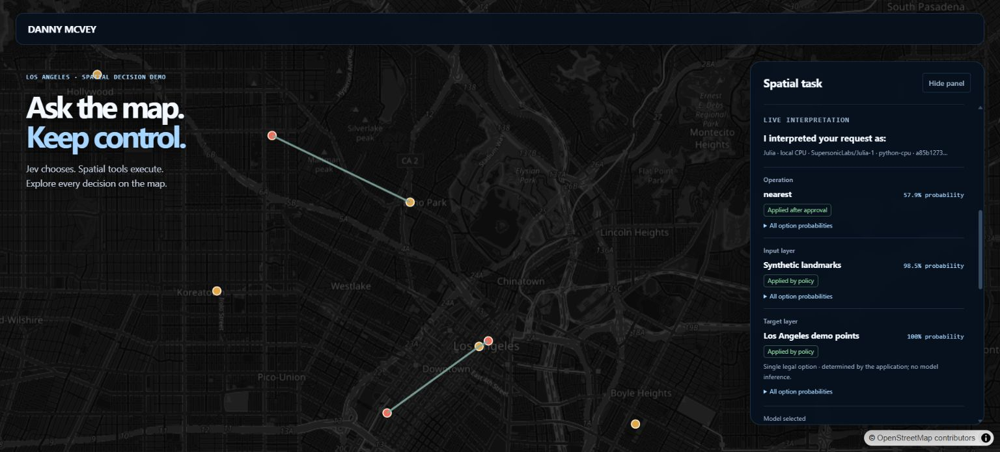

# Independent review of PR #10

Reviewed the complete PR against current `main` **26a80517db57dbc4ae08f69ebcf134d3559fa1cf** and linked issues [#4](https://github.com/danmaps/jevmap/issues/4), [#5](https://github.com/danmaps/jevmap/issues/5), [#6](https://github.com/danmaps/jevmap/issues/6), [#7](https://github.com/danmaps/jevmap/issues/7), [#8](https://github.com/danmaps/jevmap/issues/8), and [#9](https://github.com/danmaps/jevmap/issues/9). Starting PR head: **aa626b96eae7b4d2af6aa2965965fb54c5fc6740**. Both refs were fetched again before committing fixes. No merge was performed.

The review used fresh source inspection, adversarial regression cases, the real pinned Julia checkpoint, the production adapters and workflow, and Chrome against the local Vite app. It did not delegate the review to other agents or rely on the previous PR author's test results. Starting baseline: **206 tests passed**, plus typecheck.

## Material findings and fixes

| Priority | Reproduced defect | Fix and regression evidence |
| --- | --- | --- |
| P1 | A call could change after its binding was serialized while SHA-256 awaited completion. The independent test changed a selected **250 m** buffer to **100,000 m** during the digest; the original head executed the larger buffer. The lazy Turf import introduced another yield after Workbench validation. | Consistent inference snapshots, synchronous checks after hashing and immediately before geometry, and Workbench validation after the import. Tests cover call mutation during digest/import and full-data edits beyond the sample during hashing. No geometry executes for these cases. |
| P1 | Layer capabilities were sent to the model but did not restrict candidates or Workbench calls. A layer declaring only export still offered buffer/filter/select. | Enforce capability restrictions during candidate generation, parameter selection and runtime validation, including pairwise targets/overlays. Runtime configuration participates in freshness. |
| P1 | `__keep__` on an input layer bypassed its execution policy. A keep answer with confidence/probability **0.1**, while another answer had **0.9**, still authorized a new buffer. | Independent execution gates for every retained field. Canonical keep records and empty no-op diffs remain intact; weak evidence cannot authorize side effects. |
| P1 | The compatibility buffer helper hashed the goal after inference and its executor had no current state argument. Changed intent could be recorded as fresh or escape execution freshness entirely. | Capture the submitted state before inference. `executeBufferDecision` requires current state as its fifth argument and checks it; omission fails closed. The primary app uses `executeSpatialDecision`. |
| P1 | The latest commits made Julia the default despite issue #4's explicit Jev-default requirement and an absent Jev comparison. The real model still reverses nearest direction and confidently answers vague requests. | Restore Jev-latest as default. Bind an experimental-Julia review requirement into the proposal policy. Changing mutable policy to execute cannot relax it. This controls automatic effects; it does not correct the model's interpretation. |
| P2 | An approval could be paired with a receipt from a different concrete plan. Receipts shared references with mutable plans; fallback diffs included unused target/distance parameters. | Match supplied approval receipts to the original concrete plan, preserve identity when that plan becomes stale, detach receipt snapshots, clear rejected diffs, and derive accepted state changes from the executed call. UI labels unused fallback fields and blocked application separately. |
| P2 | The Julia browser adapter defaulted to the browser machine's loopback despite a same-origin proxy configuration. Singleton responses claimed CPU inference. Missing Jev usage could render zero cost, and custom Jev model aliases could be labeled Julia. | Same-origin `/api/julia` by default; explicit absolute endpoint in Node evaluation. Per-answer model/deterministic source and singleton runtime provenance. Cost display uses provider provenance, selected provider before inference, and unavailable hosted usage. |

The first four independent tests added to the original head all failed (capabilities, weak keep, in-flight call mutation, and post-inference goal hashing). Their corrected versions now pass. The lazy-import test also reproduces a concrete mutable-input window independently of the application workflow.

## Decision-to-execution and fallback checks

Model answers remain fixed IDs and probabilities. No generated JavaScript, SQL, GIS expression or model-added layer reaches execution. Generic field parsing rejects unavailable/missing candidates, malformed distributions and unresolved fields. Winner, ordered, threshold and confirmation policies remain application code; confirmation cannot authorize its own side effects. Every Workbench operation has runtime argument, geometry, layer and capacity checks.

Regression coverage exercises approved and unapproved calls, mutation of canonical fields/calls, weak retained fields, unchanged values, complete runtime edits beyond the summary sample, missing layers, selection/goal/history changes, active results, capabilities, and configured limits. Panning alone remains permitted. The final check is synchronous with deterministic GIS, closing the validation/import yield. These are application integrity checks, not signed approval credentials or protection against someone controlling the application's own JavaScript.

For nearest at **0.85** and select at **0.15**, an infeasible pairwise comparison limit rejects nearest and proposes select. The original choice and ranking remain in the receipt. The fallback is held for review, cannot inherit approval of a different call, and executes only after review of its concrete call. Its applied diff excludes the unused target and records the deterministic selected feature IDs. Insufficient-probability fallbacks, no viable call and stale maps execute nothing. No extra model call invents a fallback. Existing all-six-operation geometry tests remain passing.

## Real Julia reproduction

Checkpoint: `SupersonicLabs/Julia-1`, revision `a85b127321d580d65176c89ced8273f305745d85`; weight SHA-256 and runtime packages are recorded in the fixture reports. Actual CPU inference is distinct from fake-response regression tests and singleton application choices.

* [Original browser nearest receipt](nearest-browser-before.json): the documented task chooses nearest, with **57.924%** operation probability, **98.525%** probability for `la-landmarks` as input, and the only remaining `la-demo-points` target. The direction is reversed. This viewport required review; the older observation's higher operation confidence is not assumed to reproduce exactly.
* [Full workflow reproduction](pr-10-workflows-after.json): same captured viewport, eight demo points and three landmarks. Test-approved execution produces **three landmark-to-point lines**, not eight point-to-landmark lines. Unapproved and changed-goal approvals execute nothing. The wrong direction remains visible and is not automatically “repaired” by a heuristic.
* [Original fixture run](pr-10-fixtures-before.json) and [final fixture run](pr-10-fixtures-after.json): **14/14 valid**, **12/12 labeled raw winners and policy choices correct**, and **0/2 ambiguous abstentions**. “Make the map more useful” chooses filter at about **99.95%**. The unspecified-distance fixture chooses 250 m at about **68.63%**; ordered concentration is about **87.17%**, so the field policy applies it. These fixture dispositions measure field policy, not the additional Julia workflow approval gate.
* Full staged ambiguous workflows differ from the narrow fixtures because they use actual layer metadata and additional parameter questions: the vague operation task selects export at about **97.96%**; the omitted-distance task selects buffer and proposes 250 m, with distance review. Both are held by the workflow approval gate. Explicit test approval measures deterministic output, not semantic correctness.

The workflow report contains canonical unapproved, test-approved and stale receipts, actual output GeoJSON, provenance and every bounded payload/response. All three full workflows block without approval and block changed-goal approval.

Chrome verification also confirmed Jev is initially selected; an unavailable local Jev proxy produces an actionable error and no Julia substitution; explicit Julia uses the same-origin route; singleton target provenance is visible; and stale goal approval runs no operation. The desktop panel displays the exact call, separate probabilities/policy/execution, full distributions and receipt links while the map remains usable.



## Acceptance criteria assessment

| Issue | Evidence and qualification |
| --- | --- |
| #4 optional Julia | Explicit CPU provider, pinned setup, real end-to-end review/execution, strict native mapping and provenance, no hosted credential or browser weights, default Jev restored. **Live Jev comparative qualification remains unrun**; Julia is not qualified as default. |
| #5 reusable fields | Primary workflow uses generic fields/surfaces, legal IDs, typed applied diffs and keep. Malformed/unknown answers cannot execute. |
| #6 field policies | Distinct winner, ordered, threshold and confirmation tests; distance uses the supplied ordinal scale. Retained values cannot bypass side-effect policy. No destructive tool is implemented; confirmation covers the reusable field contract. |
| #7 semantic context | Normal model payloads have deterministic layer metadata, viewport/extent, selection and provenance without raw coordinates/FeatureCollections. Scoped geometry metrics remain explicit and bounded. |
| #8 guards/fallback | All six operations validate runtime input, fields, parameters, geometry, capabilities, counts/comparisons and export constraints. Ranked fallback and stale approval cases pass without model-invented alternatives. |
| #9 live interpretation | Canonical receipt rendering covers model/policy/execution, probability details, keep, errors, blocked calls, reviewed/approved calls and original/final fallback. Browser checked on desktop; no full mobile/device matrix was run. |

## Checks and reproduction

Local final checks pass: **222 Vitest tests** (16 more than the starting head), `npm run typecheck`, `npm run build`, **4 Python service contract tests**, and `git diff --check`. CI now includes the weight-free Python service contract. The build retains its large-chunk warning: main JavaScript about **1,087 kB** minified, **297 kB** gzip, plus a **522 kB** Turf chunk and **510 kB** map worker. No browser model/framework download was added.

One isolated workflow run hit the default 5-second test timeout at the first lazy Turf import; the repeat completed in about one second with all 34 workflow tests passing. That cold-import integration test now has a 15-second budget. No assertion was relaxed.

```powershell
npm.cmd run typecheck
npm.cmd test
npm.cmd run build
python scripts/test-julia-service.py
# Start the real service using docs/JULIA.md, then:
node scripts/reproduce-pr-10.mjs
node scripts/run-evaluation.mjs --providers=julia,jev --output=docs/review/pr-10-fixtures-after.json
```

Jev remains explicitly `not-run` with null metrics because no authorized absolute `JEV_EVALUATION_ENDPOINT` was supplied. No live Jev latency/quality comparison is claimed. CPU request times are one resident-service pass, exclude setup/download/load, and are not a statistical benchmark. Julia's weight download is about 550.5 MiB; Python/runtime/activation memory and electricity remain unmeasured. No ONNX/WebGPU qualification was run.

Remaining limitations: Julia still misinterprets direction and vague intent; review is mitigation and the human must inspect the concrete call. Finite feature/comparison/export limits do not bound all polygon vertex complexity or guarantee valid topology. Full runtime snapshots/hashes add CPU and memory work. The guards are client application policy, not an authentication system. Production still needs its own authenticated/rate-limited provider proxy and Python service lifecycle management. No merge or production deployment was performed.
